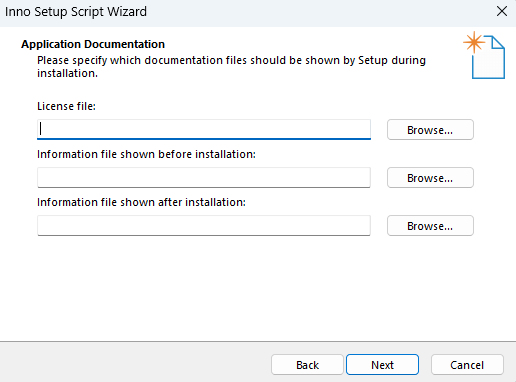

## Todo
- [x] Branch with Check structure
- [x] Remove Check structure from current -> always new folder
  - move back, Warnung genug Speicher
- [x] Add Splashscreen
- [x] ui update
- [x] freeze requ
- [x] Check if all unitests exist
- [ ] Check open todos
- [x] fix tests
- [ ] Check dynamic Links
- [ ] fix integration tests
  - [ ] Test all Buttons front to end
- [ ] Clean up unnecessary data -> only test data and programm
- [ ] Create installer
  - [ ] document in Obsidian
  - [x] create icon
  - 
  - [ ] 
- [ ] Fill in Read Me
- [ ] Make commands von job visulisier 

ui.textEdit->verticalScrollBar()->setValue(ui.textEdit->verticalScrollBar()->maximum());
x = self.scrollArea.verticalScrollBar().maximum()
    self.scrollArea.verticalScrollBar().setValue(x)
## Ui Updates
open `first_draft.ui` in python designer
apply changes save
run pyuic (pyuic5.exe first_draft.ui -o first_draft.py)
compare to current version and only replace your changes (DropLine Edits need to stay)
### Files
