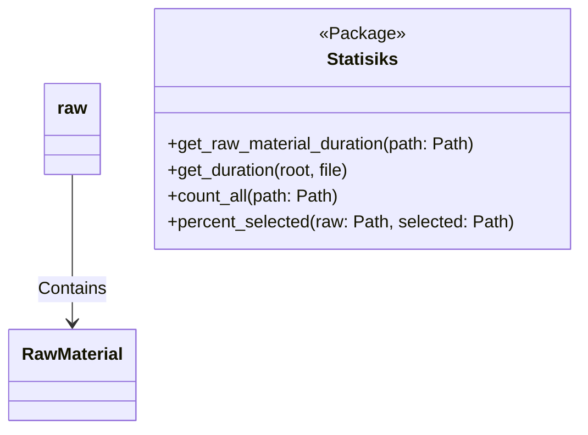
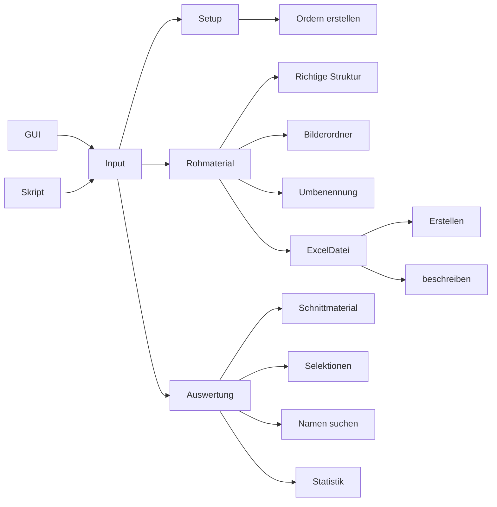

raw input

# Workflow
current worklfow
button.connect(self.run_x_action(function=runner.function))

run_x_function -> get inputs, call self.run_action(function, input)
run_action -> create Worker(function=function, input=input)
worker.run -> execute function
function -> gather input run_x_processes(internal_fn, inputs)
run_x_processes -> header, internal_fn(**kwargs)

new
button.connect(self.run_x_action(function=runner.function))

run_x_function -> get inputs, call self.run_action(function, input)
run_action -> create Worker(function=function, input=input)
worker.run -> execute function
function -> decorator, internal_fn(correct inputs)

```python
def raw_process(func):
    # @functools.wraps
    def wrapper(*args, **kwargs):
        # logging.debug(f'Calling {func.__name__}')
        validation
        func(*args, **kwargs)
        send_results
        
    return wrapper

@raw_process
def spam():
    print('spam')

@raw_process
def add3(n):
    return n+3
```
## Projektstruktur


## Workflows

## Dokumentation
https://www.programiz.com/python-programming/docstrings
