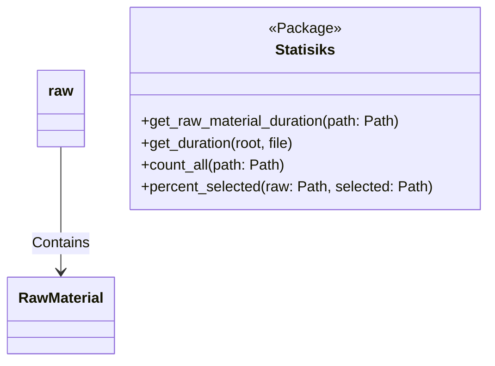
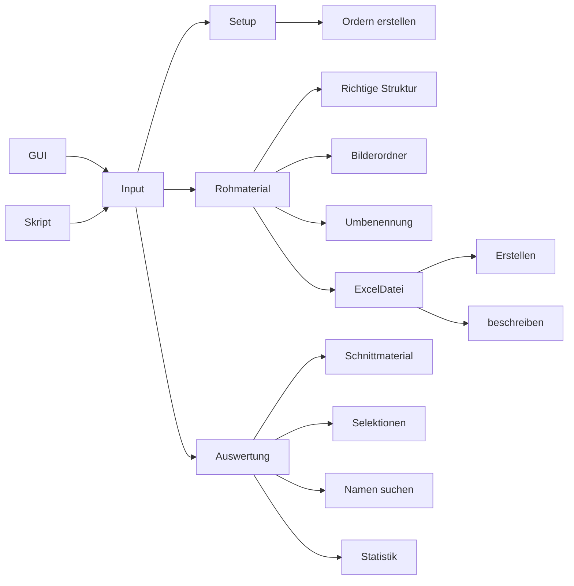

## Projektstruktur

```mermaid
classDiagram
    raw --> RawMaterial : Contains
    class Statisiks {
        +get_raw_material_duration(path: Path)
        +get_duration(root, file)
        +count_all(path: Path)
        +percent_selected(raw: Path, selected: Path)
    }
    <<Package>> Statisiks
```

## Workflows

```mermaid
flowchart LR
I[Input]
GUI --> I
Skript --> I
I --> Setup
I --> R[Rohmaterial]
I --> A[Auswertung]
Setup --> Ordner[Ordern erstellen]
R --> RS[Richtige Struktur]
R --> B[Bilderordner]
R --> Umbenennung
R --> ExcelDatei --> Erstellen
ExcelDatei --> beschreiben
A --> Schnittmaterial
A --> Selektionen
A --> N[Namen suchen]
A --> Statistik
```
## Dokumentation
https://www.programiz.com/python-programming/docstrings
